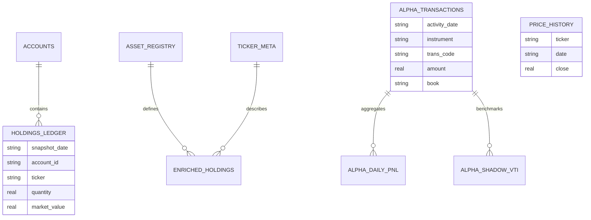

# SAGE v2.0 Database Schema

SAGE uses a local SQLite engine (`sage.db`) to provide institutional-grade financial analytics with zero cloud dependency.

## 📊 Entity Relationship Diagram

## 🗄️ Core Table Definitions

### 1. Passive Console (Index Stewardship)
- **`holdings_ledger`**: The permanent record of every account snapshot ever imported.
- **`asset_registry`**: Maps tickers to internal categories and **Simba Proxies** (historical benchmarks).
- **`ticker_meta`**: Stores real-time attributes (yield, ER, 52w high/low) fetched from Yahoo Finance.
- **`allocation_nodes`**: Defines the target strategy hierarchy (e.g., 60% Equity / 40% Bond).

### 2. Active Console (Trading Alpha)
- **`alpha_transactions`**: The raw "ledger of truth" for all active trades across Futures, Options, and Equities.
- **`alpha_daily_pnl`**: Daily aggregated MTM and realized performance.
- **`alpha_shadow_vti`**: The "Opportunity Cost" ledger. Reconstructs a hypothetical VTI portfolio for every deposit.
- **`alpha_option_trades` / `alpha_futures_trades`**: Reconstructed trade-level data for MWR and Sharpe calculations.

### 3. Shared Metadata
- **`price_history`**: Daily closing prices for all tickers (VTI, SPX, etc.).
- **`user_settings`**: Global system configurations like the Risk-Free Rate.

---
*Maintained by SAGE Core Engine*
