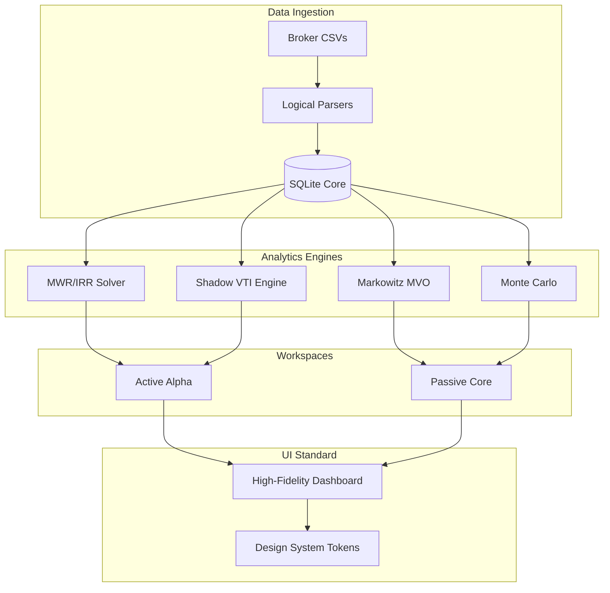

# SAGE v2.0 (Stable)
**High-Fidelity Wealth Orchestration & Active Alpha Decision Engine**

SAGE is an institutional-grade financial analytics platform that transforms raw transaction data into deterministic strategic insights. It is physically organized around two behavioral workspaces: **Passive Core** (Index stewardship) and **Active Alpha** (Trading skill).

## 🛠 Technical Architecture

## 🚀 Data Flow & Storage

SAGE operates on a **Local-First** data principle. No data ever leaves your machine.

1.  **Ingestion:** Raw CSVs from Fidelity/Schwab are parsed into the `holdings_ledger` and `alpha_transactions` tables.
2.  **Mark-to-Market:** The engine fetches historical price data via Yahoo Finance to calculate daily NAV and Unrealized Alpha.
3.  **Synthesis:** Complex financial models (MWR solvers and Markowitz optimizers) process the SQLite data into the `alpha_daily_pnl` and `enriched_holdings` views.

**Detailed Schema Documentation:** See [DATABASE.md](./DATABASE.md)

## 📊 Technical Standards
- **Shielding Index:** **1.34** (High Rigor: 1.3 lines of defense per 1 line of logic).
- **Design System:** Standardized 5-tier typographic scale (`text-ui-*`) and unified layout utilities.
- **Verification:** Mandatory Next.js MCP `get_errors` check on all functional nodes.

---

## 🛑 Open Technical Issues (Roadmap)
- **ISSUE-001:** Crisis Simulation engine is currently returning null/empty results. Needs investigation into historical proxy mapping.
- **ISSUE-002:** Tax audit pending for year-over-year liability estimates.
- **ISSUE-003:** [DEEP DIVE] Verify and stabilize Efficient Frontier calculation.
- **ISSUE-004:** Chart dimension error on /active (ResponsiveContainer).

---
*Developed by SAGE Core / Gemini CLI*
