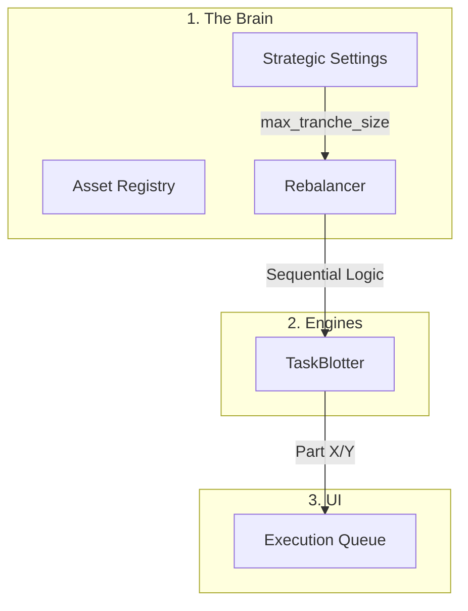

# QOL Improvements & IA Rationalization Design Spec

**Goal:** Streamline the Portfolio Dashboard's information architecture and rebalancer logic for high-signal clarity and intuitive navigation.

---

## 1. Navigation Hardening (Console Switching)
*   **Problem:** Toggling between 'Portfolio' and 'Alpha' via the switcher currently preserves the pathname (e.g., staying on `/performance`), which is confusing.
*   **Solution:** Update `ConsoleSwitcher.tsx` to enforce "First-Tab" navigation.
    *   **Portfolio Click:** Always navigate to `/` (Overview).
    *   **Alpha Click:** Always navigate to `/alpha/trades` (Trade Log).

---

## 2. Dashboard IA Rationalization (High-Signal Labels)
*   **Problem:** Redundant and overly verbose headers (e.g., "Forensic Alignment, Capital Flow and Integrity").
*   **Proposed Layout & Labels:**
    1.  **MetricTable:** Title: `"Portfolio Composition"`. Subtitle: `"Hierarchical Allocation & Drift"`.
    2.  **ForensicSankey:** Title: `"Capital Topology"`. Subtitle: `"Account-to-Asset Mapping"`.
    3.  **RiskWidget:** Title: `"Concentration Audit"`. Subtitle: `"Exposure & Expense Risk"`.
    4.  **TaskBlotter:** Title: `"Execution Queue"`. Subtitle: `"Rebalance Directives"`.

---

## 3. Rebalancer High-Integrity Flow (Sequential Tranches)
*   **Settings Integration:** Move the hardcoded `MAX_TRANCHE_SIZE` to the `user_settings` table (default: `20000`).
*   **Problem:** Large trades are split into tranches, resulting in many repeated UI rows (e.g., 10x "Trim FZROX").
*   **Solution (Progressive Acceptance):**
    *   **Consolidate UI:** The `TaskBlotter` will group tranches of the same logical trade.
    *   **Show One at a Time:** If a trade has 5 parts, the user sees **one** entry. 
    *   **Progressive Label:** The button text will say `Accept Part 1/5 ($20k)`.
    *   **Execution Flow:** Once Part 1 is "Accepted," the entry immediately updates its own state to show Part 2. The list does not grow; the single entry "evolves" until complete.
*   **Label Cleanup:** Remove the "in [Account Name]" from the instruction text since the moves are already visually grouped by Account cards.

---

## 4. Visual Cleanup
*   **TaskBlotter:** Remove the secondary "Directives Queue" and "Execution Directive" labels inside the section. The main section header is sufficient.
*   **Sankey:** Remove the "Capital Flow Audit" title inside the container.

---

### 🏛 Revised Truth Pipeline

---

**Does this revised design (one at a time sequential tranches) meet your requirements?**
